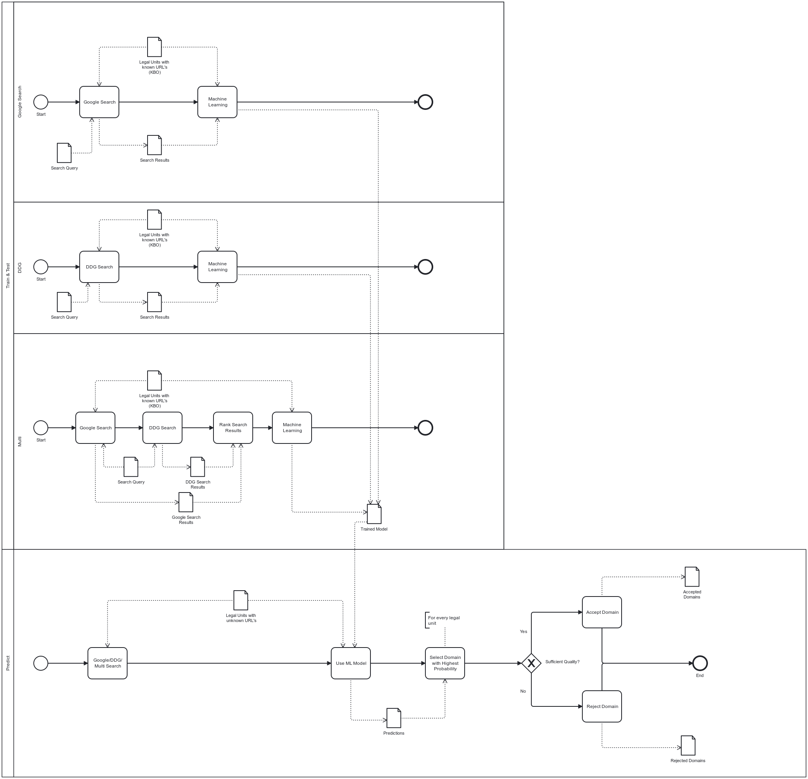

# KBO URL Linking Model Development

Welcome to the official repository for the master thesis from KU Leuven in cooperation with Statistiek Vlaanderen. This project focuses on developing a machine learning model to accurately link businesses from the KBO (Crossroads Bank for Enterprises) database to their true URLs. The work presented here is part of an academic thesis and represents a collaborative effort between the university and the official statistics agency of the Flemish Region in Belgium.

## Project Overview

This repository contains a series of Jupyter notebooks and a Python script that make up a data processing and machine learning prediction pipeline. The functions for both Jupyter notebooks and the Python script are combined in individual python scripts in the folder 'Library'. Each component of the pipeline corresponds to a step in the process of collecting, processing, visualizing, and predicting business URLs based on KBO data.

## Workflow Visualization

A BPMN (Business Process Model and Notation) diagram is included to outline the process flow, ensuring clarity and coherence in the methodology used throughout this project.



## Contents

### Jupyter Notebooks

1. `Zip_downloader.ipynb` - Handles the downloading of zipped data files.
2. `Zip_processor.ipynb` - Manages the extraction and preprocessing of the data.
3. `Data_Preparation_And_Visualization.ipynb` - Prepares the data for analysis and performs initial visualizations.
4. `Web_scraper.ipynb` - Collects additional data from the web to complement the dataset.
5. `Pipeline_ML.ipynb` - Trains and evaluates the machine learning models.

### Python Script

6. `Prediction_pipeline.py` - Serves as the operational pipeline for predictions using the trained models.

# Getting Started

This section guides you through getting set up to use the notebooks and scripts in this repository.

## Prerequisites

Before you begin, make sure you have the following installed:
- [Anaconda](https://www.anaconda.com/products/distribution) or [Miniconda](https://docs.conda.io/en/latest/miniconda.html)
- Git (optional, for cloning the repository)

## Cloning the Repository and Starting Jupyter Notebooks

To get started with the notebooks in this repository, you'll first need to clone it to your local machine. Open a terminal or Anaconda Prompt and follow these steps:

### Cloning the Repository

```shell
# Clone the repository using git
git clone [URL to the repository]

# Navigate to the repository directory
cd https://github.com/nathanvdv/URLfinder
```

## Environment Setup

Creating a dedicated Conda environment for this project is recommended to avoid dependency conflicts. You can create and activate a new environment using the following commands in your terminal or Anaconda Prompt:

```shell
# Create a new conda environment named 'kbo-url-linking'
conda create --name kbo-url-linking python=3.8

# Activate the environment
conda activate kbo-url-linking

# Install the required packages from requirements.txt
pip install -r requirements.txt
```

## Usage Guide for Jupyter Notebooks

This guide provides a step-by-step approach to executing the Jupyter notebooks included in this repository. These notebooks are part of a pipeline developed for linking businesses from the KBO database to their respective URLs.

### General Steps to Run a Notebook:

1. **Open the Notebook**: In your browser, navigate to the notebook file (`.ipynb`) within the Jupyter Notebook interface and click to open it.

2. **Install Dependencies**: Before running the notebook, make sure that all required libraries are installed, these are bundled in the requirement.txt file. These can typically be installed via `pip` or `conda`:
   ```shell
   # Use pip
   pip install -r requirements.txt
   
   # Or use conda
   conda install -r requirements.txt
    ```
## Repository Contents

This repository is structured to include a series of Jupyter notebooks and a Python script that are intended to be used sequentially for the development of a model that links businesses from the KBO database to their actual URLs. Below is a brief overview of each file along with placeholders for detailed information.

### Jupyter Notebooks

#### 1. `Zip_downloader.ipynb`
- **Description**: Downloads zipped data files from the open source dataset of KBO
- **Instructions**: Ensure you have adequate storage and network bandwidth for the downloads.
- **Output**: Zipped files saved in the designated directory.
  
#### 2. `Zip_processor.ipynb`
- **Description**: Processes the downloaded zip files, extracting and organizing the data.
- **Instructions**: Set the input directory to where the zipped files are located. Specify the output directory for extracted content.
- **Output**: .Parquet data files ready for further processing.

#### 3. `Data_Preparation_And_Visualization.ipynb`
- **Description**: Prepares data for analysis and visualizes key aspects.
- **Instructions**: Load the data files output by the Zip_processor.ipynb. Perform necessary data cleaning and visualization.
- **Output**: Cleaned data set, along with visualizations that may be used for exploratory data analysis.

#### 4. `Web_scraper.ipynb`
- **Description**: Scrapes urls from the web using Google and/or DuckDuckGo required for the analysis.
- **Instructions**: Set up the scraping parameters and target URLs. Ensure compliance with the terms of service of the websites being scraped. When scraping with Google, make use of the API.
- **Output**: Data gathered from web sources, saved and integrated with the main data set.

#### 5. `Pipeline_ML.ipynb`
- **Description**: Preprocesses the prepared data. Trains machine learning models using the preprocessed data.
- **Instructions**: Load the cleaned and combined dataset. Select models and parameters for training. Perform cross-validation.
- **Output**: Trained machine learning models, evaluation metrics, and insights.
### Python Script

#### 6. `Prediction_pipeline.py`
- **Description**:  Serves as a pipeline for making predictions with the trained models.
- **Instructions**: Run this script with Python 3.x. Ensure all dependencies are installed. Load the trained model before making predictions.
- **Output**: The output is a .parquet file with the predicted URLs and their domains. It can contain multiple different URLs. This script can be integrated into a production environment for real-time predictions.

## License

This project is open source and available under the MIT License.

